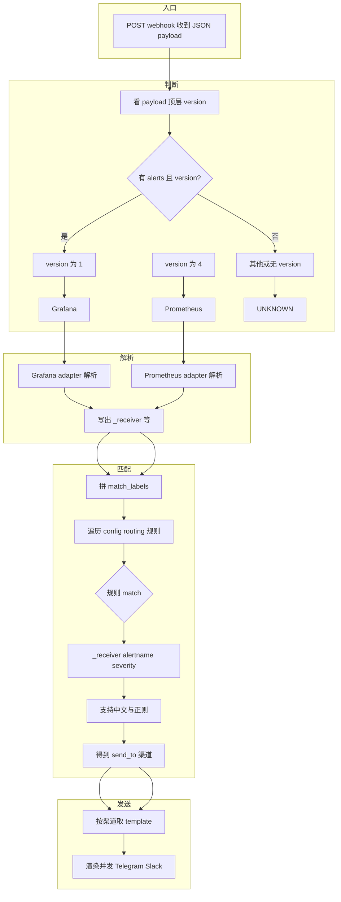
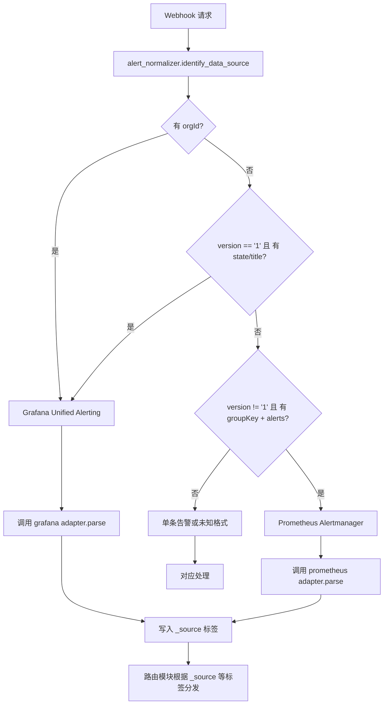
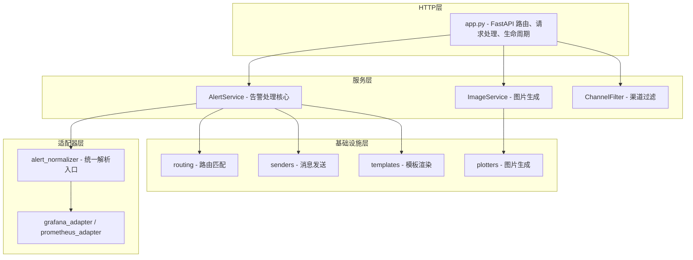
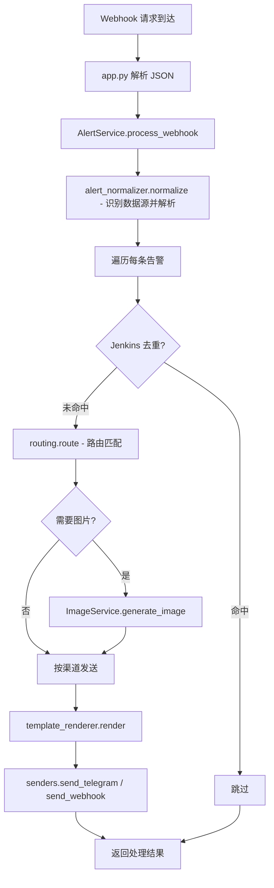
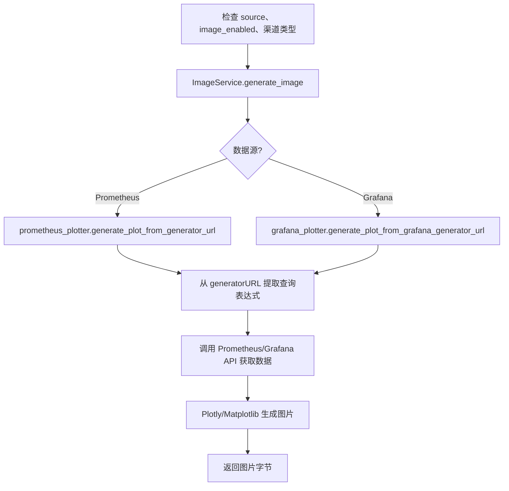

# Grafana / Prometheus 告警统一路由与模板化服务

本服务用于接收 **Prometheus Alertmanager** 和 **Grafana Unified Alerting** 的 Webhook，  
根据 **labels** 做路由分发，并对 **不同告警渠道（Telegram / Slack）** 进行统一模板化发送。

---

## 目录

- [环境要求](#环境要求)
- [快速开始](#快速开始)
- [完整流程图](#完整流程图)
- [目录结构](#目录结构)
- [架构说明](#架构说明)
- [数据源说明](#数据源说明)
- [路由与流程详解](#路由与流程详解)
- [功能特性](#功能特性)
- [配置说明与模板示例](#配置说明与模板示例)
- [告警重复排查](#告警重复排查)
- [Telegram 发送失败排查](#telegram-发送失败排查)
- [兼容性说明](#兼容性说明)
- [启动脚本与日志](#启动脚本与日志)
- [开发指南](#开发指南)

---

## 环境要求

- **Python 3.9**（推荐）或 Python 3.8+
- pip 包管理器

---

## 快速开始

### 1. 检查 Python 版本

```bash
python3.9 --version
# 或
python3 --version  # 应该显示 3.9.x
```

### 2. 安装依赖

```bash
python3.9 -m pip install -r scripts/requirements.txt
# 或
pip3 install -r scripts/requirements.txt
```

### 3. 配置

直接编辑根目录下的 `config.yaml`（建议在本地环境中维护，并在生产环境通过配置管理下发）。  
也可以通过环境变量 `CONFIG_FILE` 指定配置文件路径。

编辑 `config.yaml`，配置你的 Telegram Bot Token、Chat ID 和 Slack Webhook URL：

```yaml
channels:
  tg_prometheus_critical:
    type: telegram
    enabled: true
    bot_token: "你的Bot Token"
    chat_id: "你的Chat ID"
    template: "telegram.md.j2"
```

### 4. 启动服务

#### 方式一：使用启动脚本（推荐）

```bash
./scripts/start.sh start
./scripts/start.sh stop    # 停止
./scripts/start.sh restart # 重启
./scripts/start.sh status  # 状态
./scripts/start.sh logs    # 日志
```

#### 方式二：使用 systemd（生产环境推荐）

```bash
sudo cp scripts/alert-router.service /etc/systemd/system/
sudo vi /etc/systemd/system/alert-router.service  # 修改路径和用户
sudo systemctl daemon-reload
sudo systemctl start alert-router
sudo systemctl enable alert-router
sudo systemctl status alert-router
sudo journalctl -u alert-router -f
```

#### 方式三：直接使用 uvicorn

```bash
python3.9 -m uvicorn app:app --host 0.0.0.0 --port 8080 --workers 4
```

### 5. 配置 Webhook

在 Grafana 或 Prometheus Alertmanager 中配置 Webhook URL：

```
http://<your-host>:8080/webhook
```

---

## 完整流程图

### 1. 主流程：判断 → 解析 → 匹配 → 发送



### 2. 数据源识别流程



### 3. 系统架构分层



### 4. 告警处理端到端流程



### 5. 图片生成流程



---

## 目录结构

```
alert-router-py/
├── app.py                          # 应用入口（HTTP 路由）
├── config.yaml                     # 配置文件
│
├── alert_router/                   # 核心模块包
│   ├── __init__.py
│   ├── core/                       # 核心功能（config, models, logging, utils）
│   ├── adapters/                   # 数据源适配器（alert_normalizer, grafana, prometheus）
│   ├── services/                   # 业务服务（alert_service, image_service, channel_filter）
│   ├── plotters/                   # 绘图（base, prometheus_plotter, grafana_plotter）
│   ├── routing/                    # 路由匹配、Jenkins 去重
│   ├── senders/                    # 发送器（Telegram/Slack，连接池）
│   └── templates/                  # 模板渲染
│
├── templates/                      # Jinja2 模板文件
│   ├── grafana_slack.json.j2
│   ├── grafana_telegram.html.j2
│   ├── prometheus_slack.json.j2
│   ├── prometheus_telegram.html.j2
│   └── prometheus_telegram_jenkins.html.j2
│
├── scripts/                        # 脚本（requirements.txt, start.sh, test-*.sh, systemd）
├── archive/                        # 归档（旧代码）
├── logs/                           # 日志目录（自动创建）
└── README.md                       # 本文档
```

---

## 架构说明

- **HTTP 层** (`app.py`): 路由与请求处理，业务委托给服务层。
- **服务层** (`services/`): AlertService 告警处理、ImageService 图片生成、ChannelFilter 渠道过滤。
- **适配器层** (`adapters/`): 通过 `identify_data_source()` 识别数据源，再调用对应 adapter 解析，输出统一格式（含 `_source`）。
- **基础设施层**: routing 路由匹配、senders 发送（连接池）、templates 渲染、plotters 绘图。

设计原则：单一职责、开闭原则（新数据源/新渠道通过适配器与配置扩展）、DRY、关注点分离。

---

## 数据源说明

### Prometheus Alertmanager

- **识别**：顶层 `version == "4"` 且含 `alerts` 数组。
- **典型字段**：`version`, `groupKey`, `receiver`, `status`, `groupLabels`, `commonLabels`, `commonAnnotations`, `externalURL`, `alerts`。无 `orgId`、`state`、`title`、`message`。

### Grafana Unified Alerting

- **识别**：`version == "1"` 且含 `alerts`；或含 `orgId` 且含 `alerts`。
- **典型字段**：`version`, `orgId`, `state`, `title`, `message`, `receiver`, `alerts`，单条告警可有 `fingerprint`, `silenceURL`, `dashboardURL`, `valueString` 等。

### 区分小结

| 判断       | Prometheus | Grafana   |
|------------|------------|-----------|
| version    | `"4"`      | `"1"`     |
| orgId      | 无         | 有        |
| state/title| 无         | 常有      |

解析后由对应 adapter 写入 `_source: "prometheus"` 或 `_source: "grafana"`，路由据此及 `_receiver`、`alertname`、`severity` 等匹配。

---

## 路由与流程详解

| 阶段 | 位置 | 作用 | 依据 |
|------|------|------|------|
| **判断** | `alert_normalizer.identify_data_source(payload)` | 决定用哪个 adapter 解析 | 顶层 **version**（"1"=Grafana，"4"=Prometheus）+ 是否有 **alerts** |
| **解析** | `parse_grafana` / `parse_prometheus`，normalizer 写 _source | 输出统一 labels、_receiver、_source | 对应 adapter 只写 labels/_receiver，normalizer 补 _source |
| **匹配** | `routing.route(match_labels, config)`、`match(labels, rule["match"])` | 得到要发到哪些渠道 | match_labels = labels + _receiver + _source；规则支持中文与正则；无匹配则不发送 |
| **发送** | `alert_service` | 按渠道取 template，渲染后发 Telegram/Slack | 渠道在 config 的 channels 中，含 template、bot_token 等 |

简化文字流：

```
Webhook 入参
  → 判断：version "1" ? Grafana : version "4" ? Prometheus : 未知
  → 解析：对应 adapter 产出告警列表（含 _receiver、_source、labels）
  → 匹配：用 _receiver/alertname/severity 等对 config routing 逐条 match，得到 send_to
  → 发送：按渠道 template 渲染并发送
```

---

## 功能特性

### 核心功能

- 自动识别 Prometheus Alertmanager 与 Grafana Unified Alerting 格式
- 灵活 YAML 路由规则，渠道开关（enabled）
- 按来源/级别路由，Jinja2 模板化消息，模块化易扩展
- 完善日志（文件 + 轮转）、优雅关闭与重启

### 高级特性

- **图片生成**：Prometheus/Grafana 趋势图（Plotly/Matplotlib）
- **Jenkins 去重**：同一类 Jenkins 告警在时间窗口内只发一次
- **Grafana 去重**：同一 fingerprint+状态在窗口内只发一次（见 [告警重复排查](#告警重复排查)）
- **HTTP 连接池**：连接复用
- **渠道过滤**：统一过滤逻辑，支持图片渠道筛选
- **代理**：支持 HTTP/SOCKS5，可全局或按渠道配置

---

## 配置说明与模板示例

### 路由规则示例

```yaml
routing:
  - match:
      _source: "prometheus"
      severity: "critical|灾难"
    send_to: ["prometheus_telegram_default", "prometheus_slack"]
  - match:
      _source: "grafana"
    send_to: ["grafana_telegram"]
  - default: true
    send_to: ["fallback_channel"]
```

### 渠道与模板

- Telegram：`config.yaml` 中指定 `template: "prometheus_telegram.html.j2"` 等。
- Slack：使用 `prometheus_slack.json.j2` / `grafana_slack.json.j2`，支持 Block Kit、告警/恢复时间、description、@mention、按钮链接。

模板变量：`title`, `status`, `labels.*`, `annotations.*`, `startsAt`, `endsAt`, `generatorURL`。常用过滤器：`default('-')`, `upper`, `lower`。

模板文件位置：项目根目录 `templates/`（如 `prometheus_telegram.html.j2`, `grafana_telegram.html.j2`, `prometheus_telegram_jenkins.html.j2` 等）。渲染逻辑在 `alert_router/templates/template_renderer.py`，含时间转换与 URL 处理。

### 图片与去重配置示例

```yaml
prometheus_image:
  enabled: true
  prometheus_url: "http://prometheus:9090"
  # 数据源类型：auto（按 generatorURL 推断）/ prometheus / victoriametrics
  # VM 路径会向查询表达式注入告警 label，使 API 只返回当前告警的 series；合并告警时一图多曲线，按 label 多值过滤
  datasource: "auto"
  # 仅当 datasource 为 prometheus 时生效：是否向表达式注入 label 收窄查询（默认不注入）
  # inject_labels: false
  plot_engine: "plotly"
  lookback_minutes: 15
  timeout_seconds: 8

grafana_dedup:
  enabled: true
  ttl_seconds: 90
  clear_on_resolved: true

jenkins_dedup:
  enabled: true
  ttl_seconds: 900
  clear_on_resolved: true
```

#### vmalert 告警出图：配置 `-external.alert.source`

告警来自 **VictoriaMetrics vmalert** 时，默认的 generatorURL 为 `vmalert/alert?group_id=...&alert_id=...`，**不含查询表达式（g0.expr）**，本程序无法据此请求趋势图。

**官方依据**：VictoriaMetrics 文档与 `vmalert -help` 均说明 `-external.alert.source` 用于覆盖发往 Alertmanager 的告警 Source 链接，支持 Go 模板；文档示例：`-external.alert.source='vmui/#/?g0.expr={{.Expr|queryEscape}}'`。见 [vmalert 文档 #external-alert-source](https://docs.victoriametrics.com/vmalert.html#external-alert-source)。

在 vmalert 的**启动参数**中增加以下两项，告警链接会带上 `g0.expr`（放在 URL 的 query 中便于本程序解析），即可用 `config` 中的 `prometheus_url` 出图：

```bash
-external.url=http://<vmalert 或 VM 的访问地址>:8880
-external.alert.source=graph?g0.expr={{.Expr|queryEscape}}
```

- **`-external.url`**：告警里 generatorURL 的前缀，填 vmalert 自身地址（或可被接收端访问的 VM 地址）即可。
- **`-external.alert.source`**：官方支持的模板；`{{.Expr|queryEscape}}` 为当前规则的 PromQL/MetricsQL 表达式（已 URL 编码）。文档中 VMUI 示例把 g0.expr 放在 fragment（`#` 后）；此处用 `graph?g0.expr=...` 把表达式放在 query 里，本程序才能从 `urlparse(generatorURL).query` 解析出 `g0.expr`。

**配置方式**：若 vmalert 由 systemd 管理，在 `/etc/systemd/system/vmalert.service.d/override.conf` 的 `ExecStart` 中追加上述两个参数，然后执行 `systemctl daemon-reload && systemctl restart vmalert`。  
更多说明见：`monitoring-stack/vmalert/config/vmalert.yml`（若使用同仓库的 monitoring-stack）。

---

## 告警重复排查

**同一条告警收到 2 条** 的常见原因与处理：

1. **Grafana 侧重复投递**（最常见）  
   同一告警被多个路由/联系点命中，同一 webhook 被调多次。  
   **处理**：在 Grafana Alerting → Contact points / Notification policies 中确保同一 webhook 只在一个联系点、且每条告警只命中一条「发到该 webhook」的路径；并开启本项目的 **Grafana 去重**。

2. **同一 payload 内重复条目**  
   极少数情况下 `alerts` 数组中有相同 fingerprint 或高度相似条目。  
   **处理**：开启 Grafana 去重后，第二条会在发送前被过滤。

3. **多实例重复**  
   多进程/多实例部署且上游对同一告警请求了多个实例。  
   **处理**：Webhook 只配置一个入口（或负载均衡单一入口）；或单实例部署。当前 Grafana 去重为进程内缓存，多实例间不去重。

**Grafana 去重配置**（推荐开启）：

```yaml
grafana_dedup:
  enabled: true
  ttl_seconds: 90
  clear_on_resolved: true
```

日志中出现「Grafana 去重：同一条告警在窗口内已发送过，跳过」即表示重复已拦截。

---

## Telegram 发送失败排查

1. **图片 400（sendPhoto）**  
   趋势图非有效 PNG（超时、无数据、错误页）。当前逻辑会校验长度与 PNG 魔数，不符合则改为发文本。请确认已部署含该校验的版本。

2. **chat_id / Bot 权限（400）**  
   检查 `chat_id`（数字或 `-100xxxxxxxxxx`、`@channel`）、Bot 是否在群/频道内且未被禁用。日志中「Telegram API 响应说明」会给出具体原因。

3. **HTML 解析错误（400 + "can't parse entities"）**  
   使用 `parse_mode=HTML` 时未转义 `<`、`>`、`&`。当前在 400 且使用 parse_mode 时会自动用纯文本重试；若重试成功，可在模板中对变量做 HTML 转义。

4. **无「Telegram API 响应说明」**  
   多为未部署最新代码，拉取最新代码并重启后再复现，即可看到 API 返回的 description 便于定位。

---

## 兼容性说明

- **已实现**：Prometheus/Grafana/单条告警解析；基于 labels 的路由（精确与正则）；Telegram/Slack/Webhook；send_resolved 控制；UTC→CST；全局/渠道代理；Jinja2 模板；文件日志与轮转；优雅关闭与 systemd。
- **迁移注意**：多 Webhook 需配置多个 channel；告警聚合建议在 Alertmanager group_by 处理；模板中通过 `alert.values.B` 或 `valueString` 访问当前值。
- **导入**：推荐 `from alert_router.core import load_config`、`from alert_router.adapters.alert_normalizer import normalize`；仍支持 `from alert_router import load_config` 等向后兼容导出。

---

## 启动脚本与日志

### 启动脚本 `scripts/start.sh`

- `start` / `stop` / `restart` / `status` / `logs` / `reload`

### 环境变量

```bash
export PYTHON_CMD=python3.9
export HOST=0.0.0.0
export PORT=8080
export WORKERS=4
export TIMEOUT=30
./scripts/start.sh start
```

### 日志配置（config.yaml）

```yaml
logging:
  log_dir: "logs"
  log_file: "alert-router.log"
  level: "INFO"
  max_bytes: 10485760
  backup_count: 5
```

日志为 JSON 单行，必含 `time`, `level`, `traceId`, `message`；key 英文，message 中文。

---

## 开发指南

### 推荐导入

```python
from alert_router.core import Channel, load_config, setup_logging
from alert_router.services import AlertService, ImageService
from alert_router.routing import route, match
from alert_router.senders import send_telegram, send_webhook
from alert_router.plotters import generate_plot_from_generator_url
```

### 测试

```bash
./scripts/test-alertmanager.sh
./scripts/test-webhook.sh
```

---

## 许可证

MIT License
