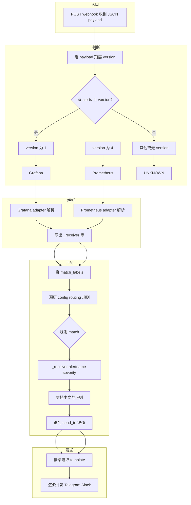

# Alert Router 流程：判断 → 解析 → 匹配 → 发送

## 流程图（Mermaid）



## 为什么判断时要「有 alerts 且 version」？

- **有 alerts**：Grafana 和 Prometheus 的 webhook 标准格式里都带 **alerts** 数组。先看有没有 `alerts`，是为了只对「成批告警的 webhook」做来源判断；没有 `alerts` 的（例如单条告警、未知格式）直接走「其他/单条告警」，不按 version 区分。
- **version**：区分是**哪个软件**发来的，就靠顶层 **version**——文档约定 Grafana 用 `"1"`，Prometheus 用 `"4"`。所以只有在「有 alerts、像是 webhook」的前提下，才看 version 是 1 还是 4，决定用 Grafana 还是 Prometheus 的解析器。

总结：**alerts** = 是不是 webhook 格式；**version** = 是 Grafana 还是 Prometheus。两者一起用，先筛格式再认来源。

---

## 各步说明

| 阶段 | 在哪里 | 做什么 | 依据/输入 |
|------|--------|--------|------------|
| **① 判断** | `alert_router/adapters/alert_normalizer.py` → `identify_data_source(payload)` | **只判断是哪个软件发来的** | 看 payload 顶层 **version**：`"1"` = Grafana，`"4"` = Prometheus；需含 **alerts** 数组 |
| **② 解析** | 同上 → `parse_grafana` / `parse_prometheus`；normalizer 再写 _source | adapter 只写 **labels**、**_receiver** 等；normalizer 按判断结果统一写 **_source** | 解析阶段不写 source，source 由「谁被调用」在 normalizer 里补上 |
| **③ 匹配** | `alert_router/routing/routing.py` → `route(match_labels, config)` 与 `match(labels, rule["match"])` | **按配置的规则匹配**，得到要发到哪些渠道 | **match_labels** = labels + _receiver + _source；**规则条件** = 配置里的 `_receiver`、`alertname`、`severity`/级别等，**支持中文和正则**；无匹配则不发送 |
| **④ 发送** | `alert_router/services/alert_service.py` | 按匹配到的渠道取 template，渲染后发 Telegram/Slack | 渠道在 config 的 **channels** 里配置，含 **template**、bot_token 等 |

## 简化文字流

```
Webhook 入参
    → 判断：version "1" ? Grafana : version "4" ? Prometheus : 未知
    → 解析：对应 adapter 产出 告警列表（含 _receiver、_source、labels）
    → 匹配：用 _receiver / alertname / severity 等 对 config routing 规则逐条 match，得到 send_to 渠道
    → 发送：按渠道的 template 渲染并发送
```

## 判断 vs 匹配

| | 判断 | 匹配 |
|---|------|------|
| **位置** | normalizer 的 `identify_data_source()` | routing 的 `route()` + `match()` |
| **作用** | 决定用哪个 adapter 解析（Grafana / Prometheus） | 决定发到哪个/哪些 channel |
| **依据** | payload 顶层 **version**（和是否有 alerts） | 配置里每条规则的 **match** 条件 |
| **看什么** | `version == "1"` 或 `"4"` | `_receiver`、`alertname`、`severity`（或级别）等，支持中文 |
